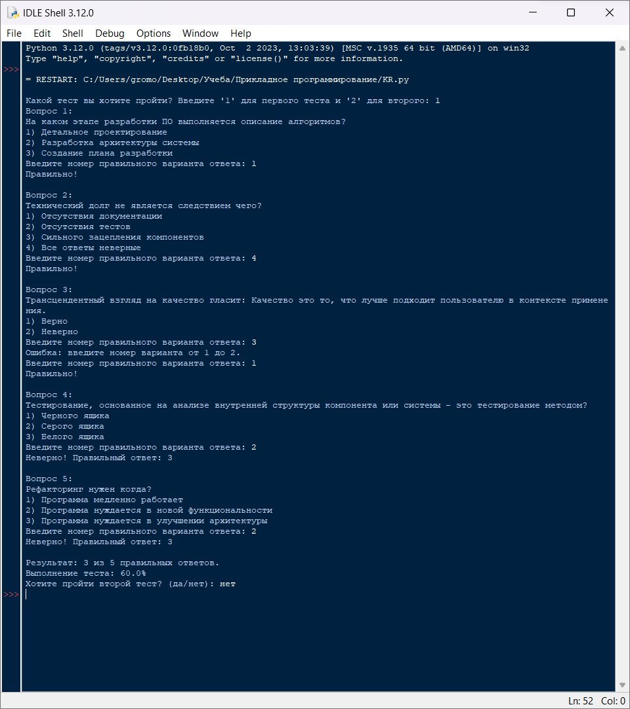
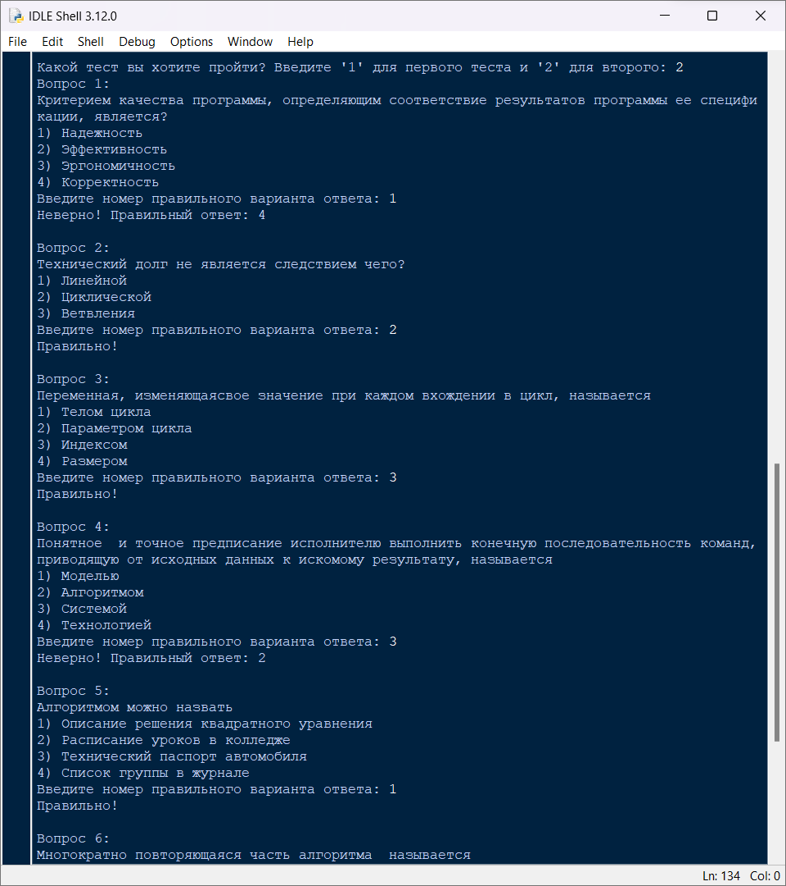
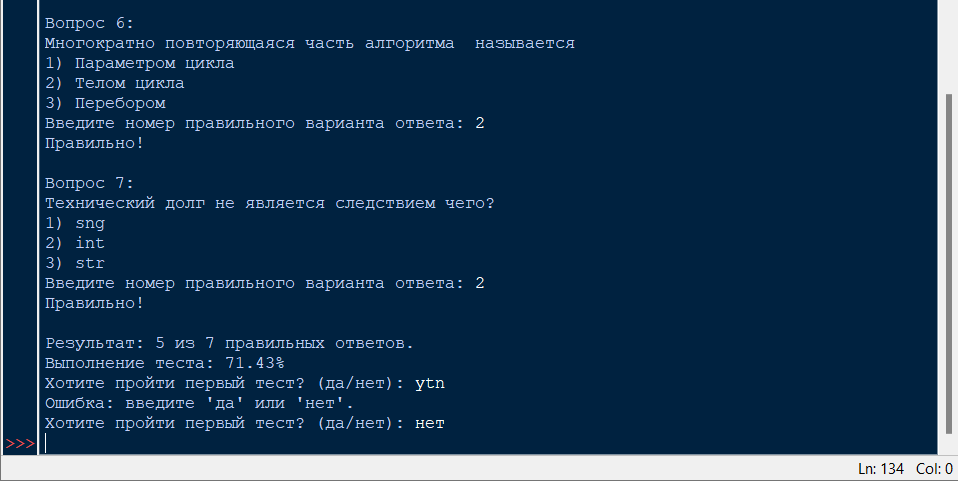
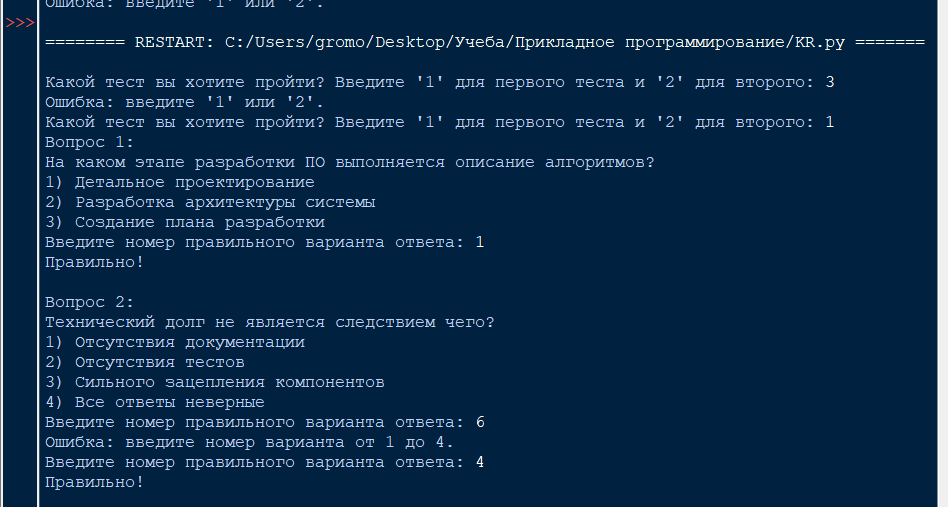
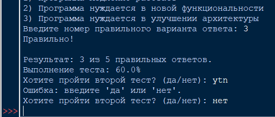

# Контрольное задание

# Исполнитель
Громова Эльвира  
Группа ФТ-220007

# Задание
Написать на любом языке программу тестирования. Тест представлен в исходном файле (структура описана ниже). Все вопросы в тесте подразумевают выбор одного правильного варианта.

Программа поочередно выводит вопрос и спрашивает ответ.  
Анализирует правильность ответа и выдает соответствующее сообщение с озвучиванием правильно ответа.  
В конце выдается количество правильных ответов из общего количества.  
Оценивается качество выполнения теста в процентах, при условии равнозначности всех вопросов (кол-во правильных ответов / общее количество вопросов в процентах).  
Обеспечить функциональные и нефункциональные критерии качества программы: качественный диалог с пользователем, обработка ошибок ввода.  
Код программы должен содержать комментарии для созданных функций и основных блоков.  

Добавить вызовы логгера (добавлять записи в log-файл) во все методы программы. Должна быть обязательно отражена вся вводимая и выводимая информация (а также дата, время, тип и результат выполнения операций).

# Среда разработки
Язык программирования: Python  
Среда разработки: IDLE

# Инструкция по работе
При открытии файла KR.py необходимо выбрать какой тест вы будете проходить. Далее нужно вписывать число - ответ на каждый вопрос. После прохождения вы получите результат за тест. Далее дайте ответ будете ли вы писать 2 тест, пройдите тест и так же получите результат за прохождение. 

# Тесты
Выполнение программы:

Тест №1 (Прохождение 1 теста)  

Тест №2 (Прохождение 2 теста)  

Тест №3 (Обработка ошибок)

